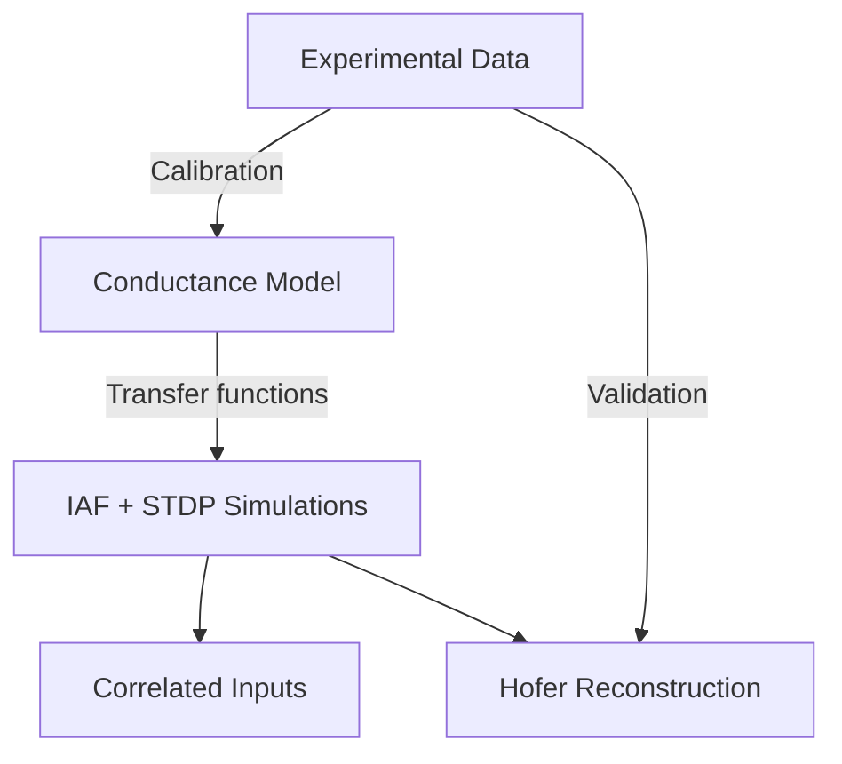

# Concepts Overview

This section provides the scientific background behind the modeling work in this project.

## The Central Question

How does **action potential (AP) amplitude** interact with **dendritic location** to shape synaptic plasticity? Experimental evidence shows that AP back-propagation attenuates along dendrites, and this attenuation varies with AP amplitude. Since spike-timing-dependent plasticity (STDP) depends on postsynaptic depolarization, compartment-specific AP attenuation should produce compartment-dependent plasticity outcomes.

## Modeling Approach

We address this question through three complementary modeling components:

### 1. Conductance Model

A biophysical model of voltage-gated calcium channels (VGCCs) and NMDA receptors predicts how AP amplitude maps to calcium influx and, ultimately, to plasticity magnitude. This provides the **transfer functions** that link AP attenuation to the depression/potentiation ratio used in the STDP rule.

[Read more →](conductance-model.md)

### 2. IAF Neuron with STDP

An integrate-and-fire neuron model with spike-timing-dependent plasticity forms the simulation core. Synapses are grouped into compartments (proximal and distal) with different depression/potentiation ratios reflecting AP attenuation.

[Read more →](iaf-stdp.md)

### 3. Correlated Input Simulations

Correlated Poisson inputs drive the IAF neuron, and we observe how proximal and distal synaptic weights diverge over time due to compartment-specific plasticity rules.

[Read more →](correlated-inputs.md)

### 4. Hofer Reconstruction

Gabor-based orientation-tuned inputs model the co-axial connectivity patterns observed experimentally. This simulation reconstructs the orientation selectivity findings from the Hofer et al. dataset.

[Read more →](hofer-reconstruction.md)

### 5. Experimental Data

The model is calibrated and validated against experimental data from an eLife publication, including dendritic site classifications and Nevian-Sakmann AP amplitude measurements.

[Read more →](experimental-data.md)
