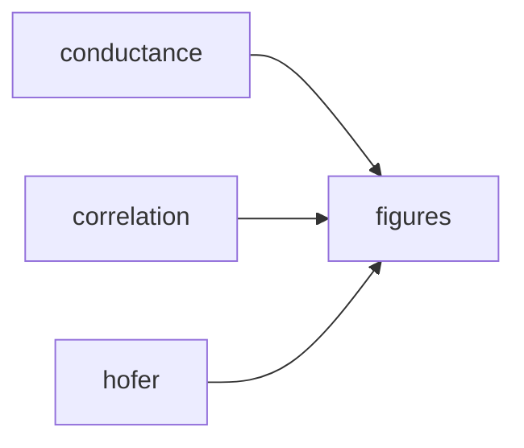

# Pipeline Overview

The pipeline orchestrates all simulation and figure-generation steps through a single entry point.

## Basic Usage

```bash
python run_pipeline.py          # run everything
python run_pipeline.py --peek   # dry run: see what would happen
python run_pipeline.py --force  # re-run even if outputs exist
```

## Pipeline Steps

The pipeline runs four steps in order:



| Step | Script | Output |
|------|--------|--------|
| `conductance` | `scripts/conductance_data.py` | `data/conductance_runs.joblib` |
| `correlation` | `scripts/iaf_correlation.py` | `results/iaf_runs/correlated/{run_name}/` |
| `hofer` | `scripts/iaf_hofer_reconstruction.py` | `results/iaf_runs/hofer/{run_name}/` |
| `figures` | `scripts/make_figures.py` | `figures/` |

### Running specific steps

```bash
python run_pipeline.py --steps conductance         # just conductance data
python run_pipeline.py --steps correlation hofer   # just IAF simulations
python run_pipeline.py --steps figures             # just regenerate figures
python run_pipeline.py --steps conductance figures # conductance + figures
```

Each step checks whether its expected outputs already exist. If they do, the step is skipped unless `--force` is passed.

## Configuration

The pipeline uses a 3-layer configuration merge (see [Configuration](configuration.md) for details):

```bash
python run_pipeline.py                          # uses pipeline.yaml defaults
python run_pipeline.py --config manuscript.yaml # override with manuscript settings
```

## Reproducing Manuscript Figures

To generate figures using the exact simulation data from the manuscript:

1. Download the publication data from the data repository into `results/iaf_runs/`
2. Run:

```bash
python run_pipeline.py --config manuscript.yaml --steps figures
```

## Direct Script Usage

Each script also works standalone for more fine-grained control:

```bash
python scripts/conductance_data.py --num_ap_amplitudes 10
python scripts/iaf_correlation.py --run_name test --repeats 1 --duration 100
python scripts/make_figures.py --figures 4 5 6 --correlated-full-run my_run
```

!!! warning
    The full pipeline (conductance + correlation + hofer + figures) can take hours to days depending on your hardware because the STDP simulations run sequentially. To get a quick test, reduce the duration in `pipeline.yaml`, but results may not reach steady-state.
